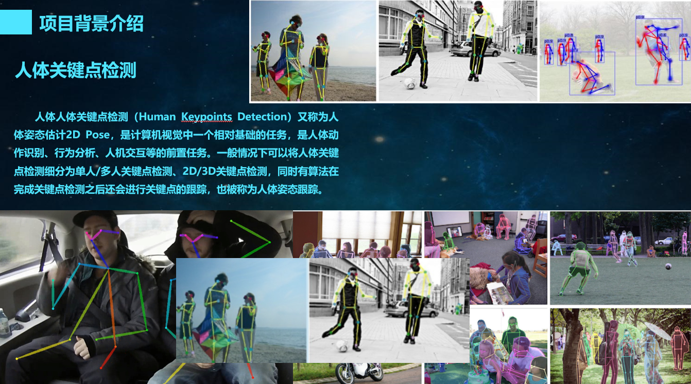
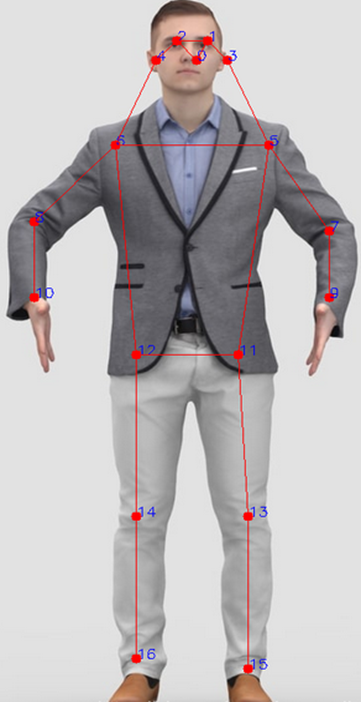
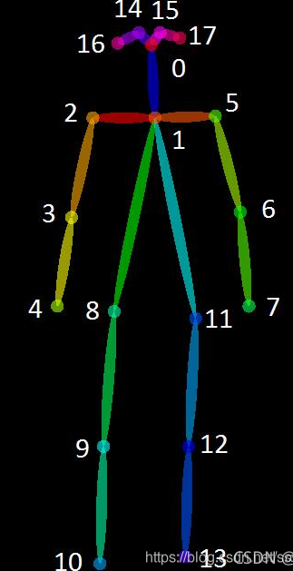
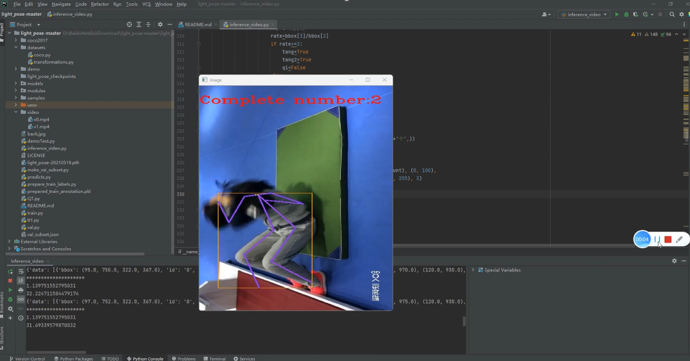

# **项目说明：**

本项目是在论文**Real-time 2D Multi-Person Pose Estimation on CPU**提供的代码基础上进行的功能实现。

上述论文是基于OpenPose算法进行了改进，引入了MobileNet作为轻量化网络加快推理速度。

由于实验环境受限，本项目**没有再进一步训练**，而是直接使用上述提供的预权重进行**运动检测**功能实现【预权重链接见文末】。
# **项目已实现功能：**
**人体关键点检测**

**深蹲运动状态检测**

**仰卧起坐计数检测**


------
# 环境

```
windows 10
NVIDIA GTX 1650
CPU intel i5 9th
CUDA 10.2
torch>=0.4.1
torchvision>=0.2.1
pycocotools==2.0.0
opencv-python>=3.4.0.14
numpy>=1.14.0
```
------


